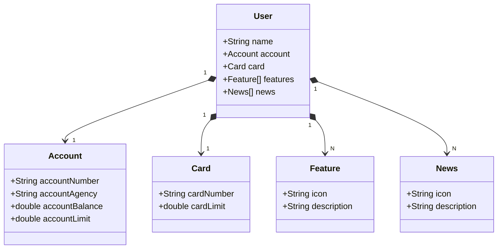

# API RESTful criada com Java para a Santander Dev Week 2024

## Diagrama de classe 

```mermaid
classDiagram
    class User {
        +String name
        +Account account
        +Card card
        +Feature[] features
        +News[] news
    }

    class Account {
        +String accountNumber
        +String accountAgency
        +double accountBalance
        +double accountLimit
    }

    class Card {
        +String cardNumber
        +double cardLimit
    }

    class Feature {
        +String icon
        +String description
    }

    class News {
        +String icon
        +String description
    }

    User "1" *-->"1" Account
    User "1" *--> "1" Card
    User "1" *-->"N" Feature
    User "1"*-->"N" News
```
